# Swift Package Manager   

***This is a xcode11 built-in integration of thirdpart dependency package management tool.  It provide developer a simple way to use the package shared by others. It deals with dependency management、 versioning、 compilation and linking between packages directly.  This tool is a bit like Cocospods.***

##  1. Add a third part dependency package Alarmofire to Project  

1. Create a project

2. select  "PROJECT" -> "Swift Packages" -> click "+" button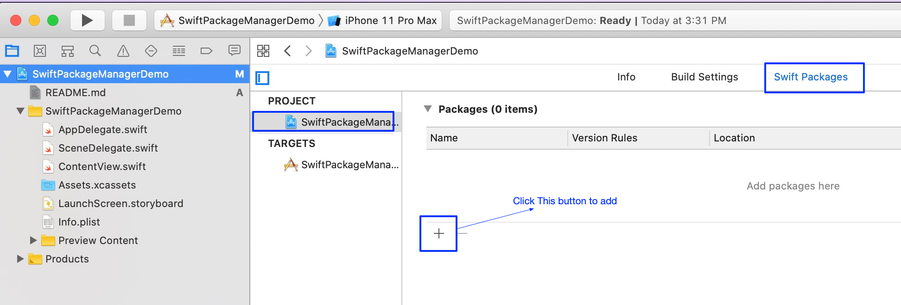

3. Input the dependency package repo url -> click "Next" button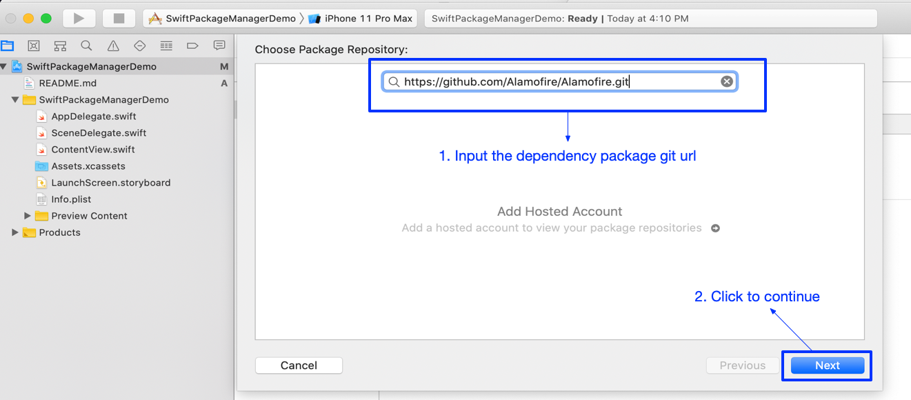

4. Click to select "version" rule (here we choose "Exact") -> click "Next" to continue

    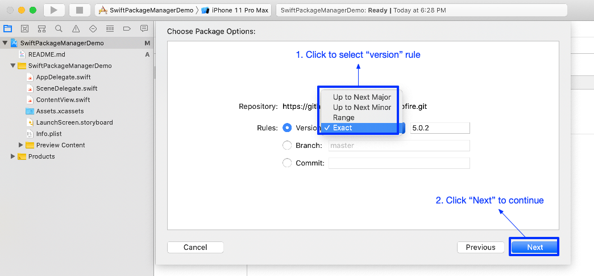

    Version Rules: 

    * Up to Next Major（5.0.2） :  package version maybe 5.0.2 or 5.1.2 ... , but will not higher or equel to 6.0.0

    * Up to Next Minor() :  package version maybe 5.0.2 or 5.0.2 ... , but will not higher or equel to 5.1.0
    * Range (5.0.2 - 5.1.0):   package version will between 5.0.2 and 5.1.0
    * Exact(5.0.2):  package version will exactly be 5.0.2

5. Package add success to current project
    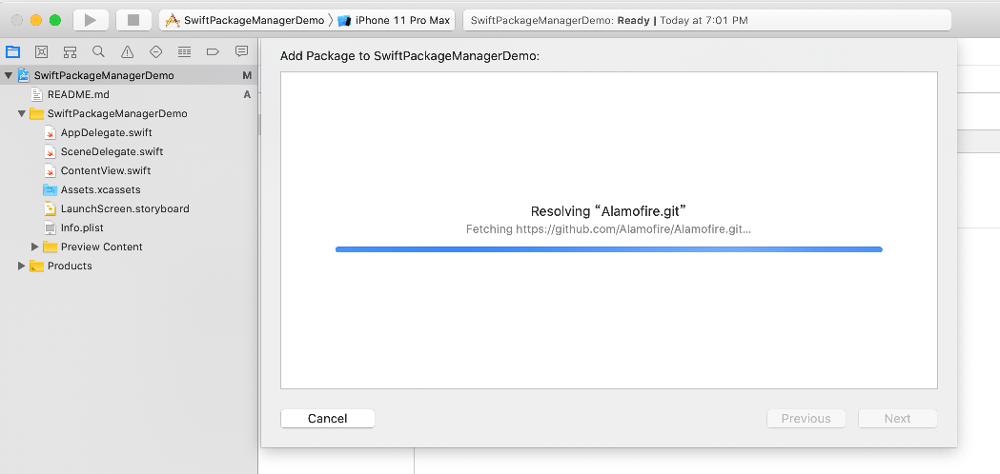

    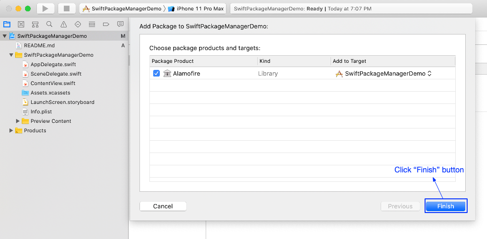

    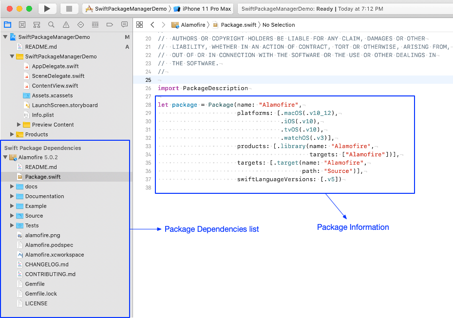

    Package.swift file is a bit like Cocoapods .podspec+.podfile files.

6. Jouney to use this third pard package in the current package!!!

    

##  2. Create a Swift Package  (Example - AddLibrary) 

1. "File" -> "New" -> Swift Package

    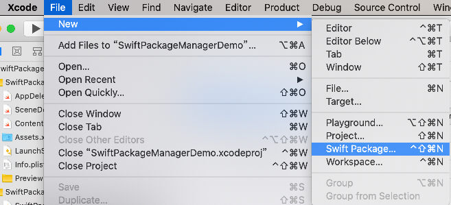

2. Input library name "AddLibrary" -> click "Create"

    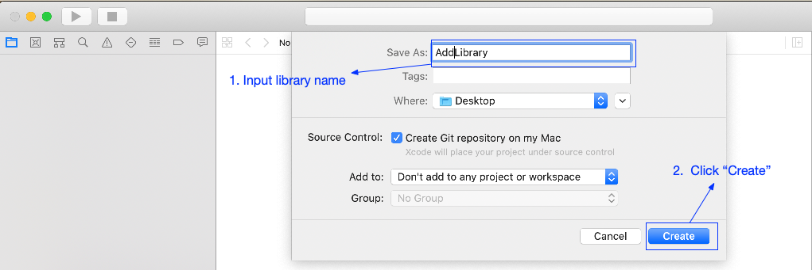

3. Initial Library

    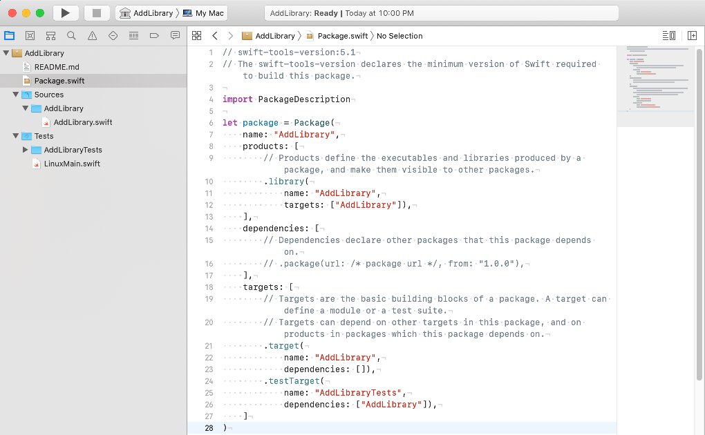

4. Edit "AddLibrary.swift"

    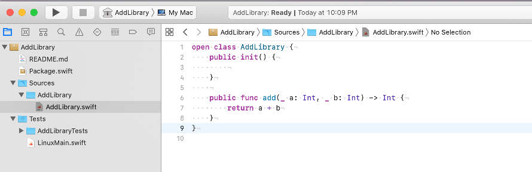
       define a class named AddLibrary, It has a public function named "add"

5. Push AddLibrary code to repo "https://github.com/Carrie925/AddLibrary.git"

    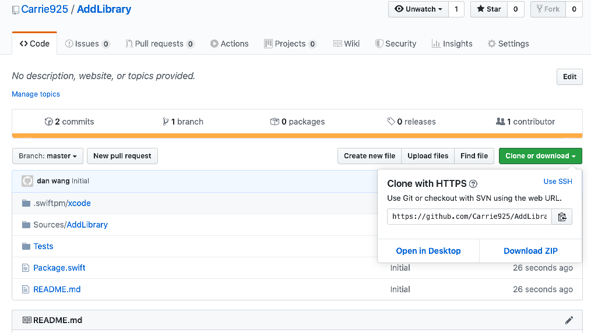

       Click "Create a new release"

    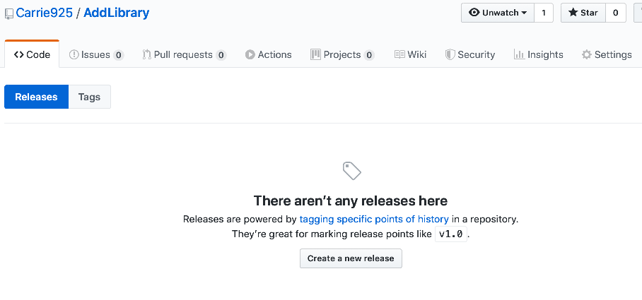

    Edit Release information

    

    1.0.0 Release create success

    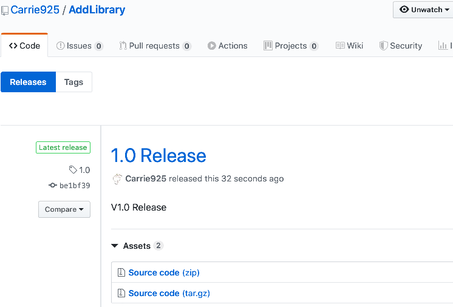

6. add "AddLibrary" to the swift packages list of project "SwiftPackageManagerDemo"

    

    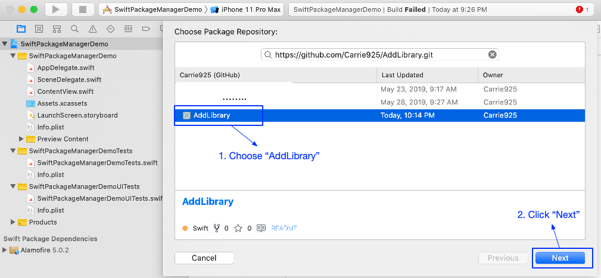
    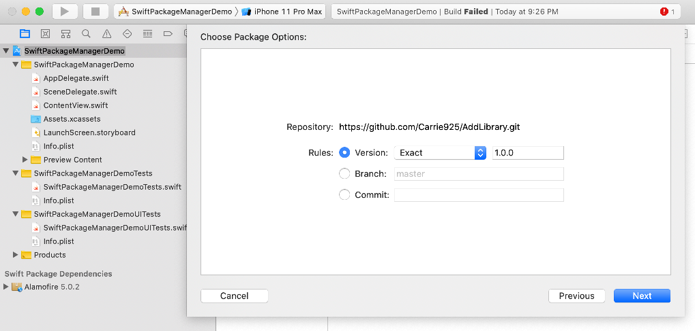
7. call the interface function of AddLibrary in project "SwiftPackageManagerDemo"

    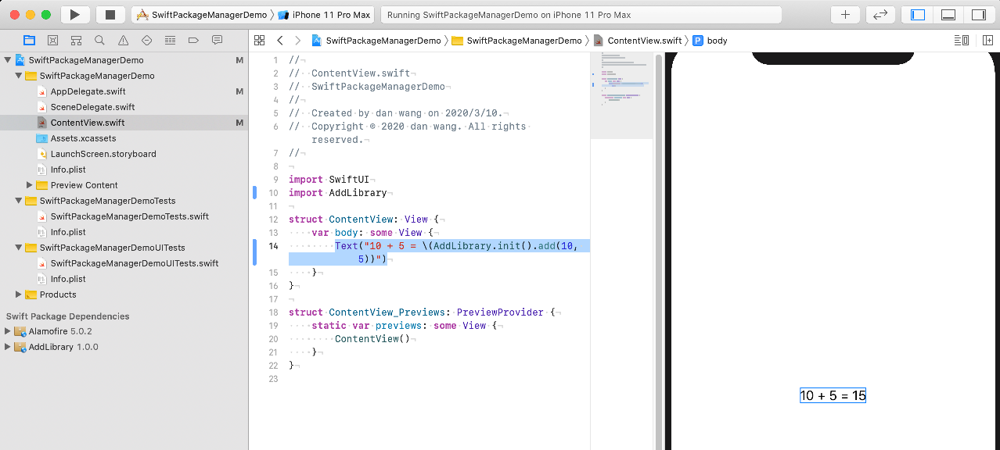
    
##  

###### Author:  Carrie D Wang